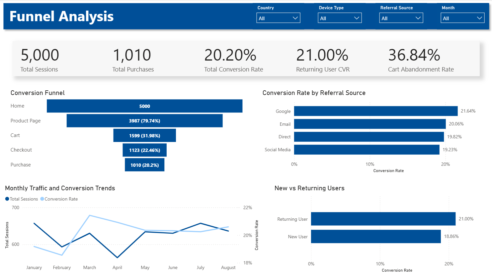
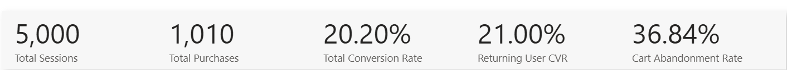
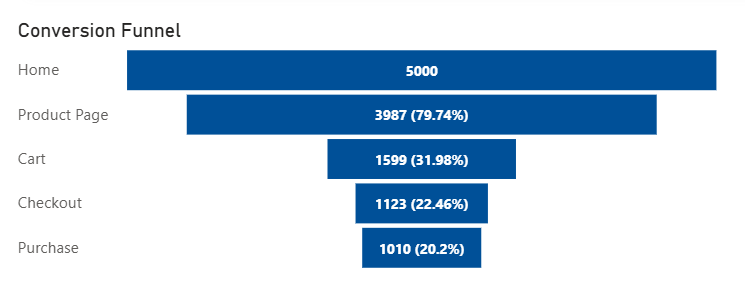
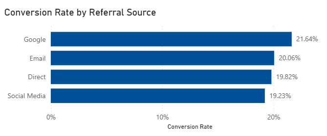
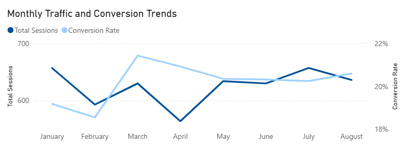
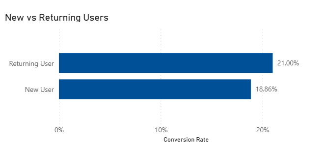
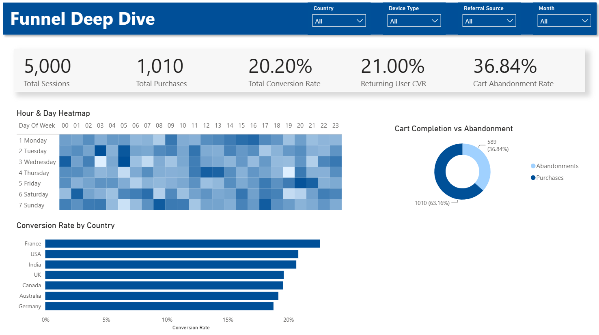
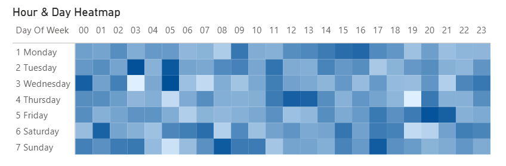
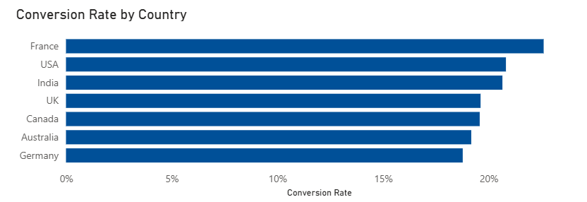
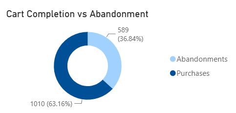

# E-commerce Customer Funnel Analysis Dashboard

An end-to-end Data Analytics project using **SQL Server** and **Power BI** to analyze customer behavior throughout an e-commerce purchase journey. This project identifies conversion bottlenecks, evaluates marketing performance, and provides actionable business recommendations through an interactive dashboard.

---

# Table of Contents

- [Project Overview](#project-overview)
- [Business Problem](#business-problem)
- [Dataset](#dataset)
- [Dashboard Overview](#dashboard-overview)
- [Executive Summary](#executive-summary)
- [Funnel Deep Dive](#funnel-deep-dive)
- [SQL Analysis](#sql-analysis)
- [Key Insights](#key-insights)
- [Business Recommendations](#business-recommendations)
- [Technical Skills Demonstrated](#technical-skills-demonstrated)
- [Repository Structure](#repository-structure)
- [Future Improvements](#future-improvements)

---

# Project Overview

This project analyzes customer interactions across an e-commerce website to understand how users progress through the purchase funnel—from landing on the homepage to completing a purchase.

Using **SQL Server** for data transformation and **Power BI** for visualization, the project uncovers customer behavior, conversion bottlenecks, and marketing performance to support data-driven business decisions.

---

# Business Problem

Although the website attracts thousands of visitors, only a fraction complete a purchase.

This project aims to answer the following business questions:

- Where do customers drop off in the purchase funnel?
- Which marketing channels generate the highest conversion rates?
- Which customer segments perform best?
- Which countries have the highest conversion rates?
- Do returning users convert better than new users?
- What percentage of customers abandon their shopping cart?
- Which days and hours generate the highest conversions?

---

# Dataset

The dataset contains customer journey data collected from an e-commerce website.

## Features

- User ID
- Session ID
- Timestamp
- Page Type
- Device Type
- Referral Source
- Country
- Time on Page
- Items in Cart
- Purchase Status

## Customer Journey

```text
Home
   ↓
Product Page
   ↓
Cart
   ↓
Checkout
   ↓
Purchase
```

---

# Dashboard Overview

## Executive Summary Dashboard



Provides a high-level overview of website performance through KPIs, funnel metrics, marketing performance, and customer behavior.

---

# Executive Summary

## KPI Overview



### Purpose

Provides an executive snapshot of overall website performance.

### Metrics

- Total Sessions
- Total Purchases
- Conversion Rate
- Returning User Conversion Rate
- Cart Abandonment Rate

### Key Insights

- Overall conversion rate is **20.20%**.
- Returning users convert better than new users.
- More than one-third of customers abandon their cart before purchasing.

---

## Conversion Funnel



### Purpose

Visualizes customer progression across each stage of the purchase journey.

```text
Home
 ↓
Product Page
 ↓
Cart
 ↓
Checkout
 ↓
Purchase
```

### Key Insights

- Nearly **80%** of visitors browse product pages.
- The largest drop occurs between the **Product Page** and **Cart** stages.
- Only **20.2%** of sessions complete the entire purchase journey.

---

## Conversion Rate by Referral Source



### Purpose

Compares conversion performance across marketing channels.

### Key Insights

- Google generated the highest conversion rate.
- Social Media produced the lowest conversion rate.
- Referral quality has a measurable impact on conversions.

---

## Monthly Traffic & Conversion Trends



### Purpose

Tracks website traffic alongside conversion performance over time.

### Key Insights

- Website traffic remains relatively stable throughout the year.
- Conversion rate shows only minor fluctuations, indicating consistent performance.

---

## New vs Returning Users



### Purpose

Compares purchasing behavior between new and returning customers.

### Key Insights

- Returning customers convert at a higher rate than first-time visitors.
- Customer retention contributes significantly to overall revenue.

---

# Funnel Deep Dive



This dashboard focuses on customer segmentation and behavioral analysis.

---

## Conversion Rate Heatmap



### Purpose

Shows conversion rates by **hour of the day** and **day of the week**.

### Key Insights

- Conversion rates vary across different days and hours.
- Peak-performing periods can be leveraged for campaign scheduling and promotional activities.

---

## Conversion Rate by Country



### Purpose

Compares conversion performance across geographic markets.

### Key Insights

- France recorded the highest conversion rate.
- Germany showed the lowest conversion performance.
- Geographic segmentation highlights regional optimization opportunities.

---

## Cart Completion vs Abandonment



### Purpose

Compares completed purchases against abandoned carts.

### Key Insights

- **36.84%** of customers abandoned their cart before completing checkout.
- Improving the checkout experience represents the biggest opportunity for increasing conversions.

---

# SQL Analysis

SQL Server was used to clean, transform, and analyze customer journey data.

## Analysis Performed

- Funnel Analysis
- Conversion Rate Analysis
- Customer Segmentation
- Cart Abandonment Analysis
- Cohort Analysis
- Time-Based Analysis
- Referral Source Performance
- Country Performance

## SQL Concepts Used

- Common Table Expressions (CTEs)
- Views
- Window Functions
- Aggregate Functions
- CASE Statements
- Conditional Aggregation
- GROUP BY

---

# Key Insights

- Analyzed **5,000 customer sessions**.
- Overall website conversion rate was **20.20%**.
- Google delivered the highest conversion rate among referral sources.
- Returning users outperformed new users in conversion rate.
- Approximately **36.84%** of customers abandoned their shopping cart.
- France achieved the highest country-level conversion rate.
- Customer conversions varied by both hour and day of the week.

---

# Business Recommendations

Based on the analysis, the following recommendations are proposed:

- Improve the checkout experience to reduce cart abandonment.
- Increase investment in high-performing referral channels.
- Launch retention campaigns targeting first-time customers.
- Schedule marketing campaigns during high-converting hours.
- Optimize website performance in lower-converting geographic markets.
- Personalize customer experiences for returning visitors.

---

# Technical Skills Demonstrated

## SQL Server

- Data Cleaning
- Session-Level Aggregation
- Funnel Analysis
- Customer Segmentation
- Cohort Analysis
- Window Functions
- Views
- CTEs

## Power BI

- Data Modeling
- DAX Measures
- KPI Cards
- Funnel Chart
- Heatmap Matrix
- Line Charts
- Bar Charts
- Donut Charts
- Interactive Slicers

## Business Analytics

- Customer Journey Analysis
- Funnel Analysis
- Cart Abandonment Analysis
- Customer Segmentation
- Marketing Performance Analysis
- Geographic Analysis

---

# Repository Structure

```text
📂 E-commerce-Funnel-Analysis
│
├── Data
│   └── customer_journey.csv
│
├── SQL
│   ├── data_cleaning.sql
│   ├── funnel_analysis.sql
│   ├── segmentation_analysis.sql
│   └── cohort_analysis.sql
│
├── Power BI
│   └── Funnel Analysis.pbix
│
├── Images
│   ├── 01_dashboard_overview.png
│   ├── 02_kpi_cards.png
│   ├── 03_conversion_funnel.png
│   ├── 04_referral_source.png
│   ├── 05_monthly_trends.png
│   ├── 06_returning_users.png
│   ├── 07_funnel_deep_dive.png
│   ├── 08_heatmap.png
│   ├── 09_country_conversion.png
│   └── 10_cart_abandonment.png
│
└── README.md
```

---

# Future Improvements

- Integrate Google Analytics 4 (GA4) event-level data.
- Include revenue and average order value metrics.
- Build customer retention dashboards.
- Develop predictive models for purchase probability.
- Connect to a live data source for real-time dashboard updates.

---

## Author

**Nagarjunan Selvam**

If you found this project useful, consider giving this repository a ⭐.
