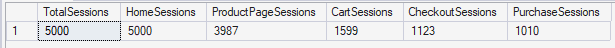

# Funnel Analysis Project

## **1. Session-Level Funnel Stage Aggregation**

This query transforms page-level data into session-level flags to identify whether a session reached each funnel stage. 
It ensures each session is counted only once per stage using MAX aggregation.

```sql
With cte as (
Select 
	max(case when pagetype='home' then 1 else 0 end) as Reached_Home,
	max(case when pagetype='product_page' then 1 else 0 end) as Reached_ProductPage,
	max(case when pagetype='cart' then 1 else 0 end) as Reached_Cart,
	max(case when pagetype='checkout' then 1 else 0 end) as Reached_Checkout,
	max(case when pagetype='confirmation' then 1 else 0 end) as Reached_Purchase
from customer_journey
group by SessionID
)

Select
	count(*) as TotalSessions,
	sum(reached_home) as HomeSessions,
	sum(Reached_ProductPage) as ProductPageSessions,
	sum(Reached_Cart) as CartSessions,
	sum(Reached_Checkout) as CheckoutSessions,
	sum(reached_Purchase) as PurchaseSessions
from cte
```

**Output:** Funnel Stage Session Counts



## 2. Funnel Stage Conversion and Drop-off Analysis

This query calculates stage-to-stage conversion rates and drop-off percentages across the e-commerce funnel.

```sql
With CTE as (
Select 
	max(case when pagetype='home' then 1 else 0 end) as Reached_Home,
	max(case when pagetype='product_page' then 1 else 0 end) as Reached_ProductPage,
	max(case when pagetype='cart' then 1 else 0 end) as Reached_Cart,
	max(case when pagetype='checkout' then 1 else 0 end) as Reached_Checkout,
	max(case when pagetype='confirmation' then 1 else 0 end) as Reached_Purchase
from customer_journey
group by SessionID
)
Select
	(100*sum(Reached_ProductPage)/sum(reached_home)) as [HomeToProductPageCVR%],
	(100*sum(Reached_Cart)/sum(Reached_ProductPage)) as [ProductPageToCartCVR%],
	(100*sum(Reached_Checkout)/sum(Reached_Cart)) as [CartToCheckoutCVR%],
	(100*sum(Reached_Purchase)/sum(Reached_Checkout)) as [CheckoutToPurchaseCVR%],
	100-(100*sum(Reached_ProductPage)/sum(reached_home)) as [HomeToProductPageDrop%],
	100-(100*sum(Reached_Cart)/sum(Reached_ProductPage)) as [ProductPageToCartDrop%],
	100-(100*sum(Reached_Checkout)/sum(Reached_Cart)) as [CartToCheckoutDrop%],
	100-(100*sum(Reached_Purchase)/sum(Reached_Checkout)) as [CheckoutToPurchaseDrop%]
from CTE
```

**Output:**


Insights:

- The biggest drop-off (60%) occurs at the Product Page → Cart stage, indicating a key conversion bottleneck.
- Strong Home → Product conversion (79%) shows effective initial engagement.
- High Checkout → Purchase conversion (89%) suggests a seamless checkout experience.

## 3. Conversion Rate by Segment

Evaluating conversion rates across key segments by aggregating data at the session level to ensure accurate measurement of user behavior.

```sql
Create view segment_view as (
Select 
	SessionID,
	DeviceType,
	ReferralSource,
	Country,
	Max(cast(purchased as int)) as is_purchased
from customer_journey
group by SessionID, DeviceType, ReferralSource, Country
)
-- Segmenting by Source
Select
	ReferralSource,
	Count(sessionid) as TotalSessions,
	sum(is_purchased) as TotalPurchases,
	round((100.0*sum(is_purchased))/Count(sessionid),2) as ConversionRate
from segment_view
Group by ReferralSource
Order by ConversionRate desc;

-- Segmenting by Country
Select
	Country,
	Count(sessionid) as TotalSessions,
	sum(is_purchased) as TotalPurchases,
	round((100.0*sum(is_purchased))/Count(sessionid),2) as ConversionRate
from segment_view
Group by country
order by ConversionRate desc;

-- Segmenting by Device
Select
	DeviceType,
	Count(sessionid) as TotalSessions,
	sum(is_purchased) as TotalPurchases,
	round((100.0*sum(is_purchased))/Count(sessionid),2) as ConversionRate
from segment_view
Group by DeviceType
order by ConversionRate desc;
```

Output:


Insights:

- Google is the highest-performing channel (21.64% CVR), indicating strong intent-driven traffic.
- Social Media drives comparable traffic but converts the least (19.23%), suggesting low purchase intent.
- France stands out as the top-performing market (22.61% CVR), indicating strong regional demand.
- Germany shows the lowest conversion rate (18.78%), highlighting a potential area for optimization.
- Conversion rates are consistent across devices (~20%), indicating a well-optimized cross-device experience.

## 4. Time-Based Conversion Analysis

This analysis evaluates how user conversion behavior varies across different hours of the day and days of the week.
Session-level timestamps are derived using the session start time to ensure accurate time attribution.

```sql
Create view time_analysis_view as (
Select 
	SessionID,
	Datename(weekday, min(timestamp)) as Day_of_Week,
	Datepart(hour, min(timestamp)) as Hour_of_Day,
	Max(cast(purchased as int)) as is_purchased
from customer_journey
group by  SessionID
)
-- Day of the Week Analysis
Select
	Day_of_Week,
	Count(sessionid) as TotalSessions,
	sum(is_purchased) as TotalPurchases,
	round((100.0*sum(is_purchased))/Count(sessionid),2) as ConversionRate
from time_analysis_view
Group by Day_of_Week
Order by ConversionRate desc;
-- Hour of the Day Analysis
Select
	Hour_of_Day,
	Count(sessionid) as TotalSessions,
	sum(is_purchased) as TotalPurchases,
	round((100.0*sum(is_purchased))/Count(sessionid),2) as ConversionRate
from time_analysis_view
Group by Hour_of_Day
Order by ConversionRate desc;
```

Output:


Insight:

- Conversion peaks during early morning and evening hours, with lower intent observed during late evening.
- Sundays show the highest conversion, while mid-week (especially Wednesday) sees the lowest performance.

## 5. Cart Abandonment Analysis

```sql
Create view cart_abandonment_view as (
Select 
	SessionID,
	ReferralSource,
	Country,
	DeviceType,
	max(case when pagetype='cart' then 1 else 0 end) as Reached_Cart,
	Max(cast(purchased as int)) as is_purchased
from customer_journey
group by  SessionID, ReferralSource, DeviceType, Country
)
-- To Find overall cart abandonment metrics
Select
	sum(Reached_Cart) as Total_Cart_Sessions,
	sum(case when Reached_Cart=1 and is_purchased=1 then 1 else 0 end) as Cart_to_Purchases,
	sum(case when Reached_Cart=1 and is_purchased=0 then 1 else 0 end) as Cart_Abandonment,
	round((sum(case when Reached_Cart=1 and is_purchased=0 then 1 else 0 end)*100.0)/
	sum(Reached_Cart),2) as Abandonment_Rate
from cart_abandonment_view;

-- To Find cart abandonment metrics by each segment
Select
	ReferralSource,
	sum(Reached_Cart) as Total_Cart_Sessions,
	sum(case when Reached_Cart=1 and is_purchased=1 then 1 else 0 end) as Cart_to_Purchases,
	sum(case when Reached_Cart=1 and is_purchased=0 then 1 else 0 end) as Cart_Abandonment,
	round((sum(case when Reached_Cart=1 and is_purchased=0 then 1 else 0 end)*100.0)/
	sum(Reached_Cart),2) as Abandonment_Rate
from cart_abandonment_view
Group by ReferralSource
order by Abandonment_Rate desc;

Select
	DeviceType,
	sum(Reached_Cart) as Total_Cart_Sessions,
	sum(case when Reached_Cart=1 and is_purchased=1 then 1 else 0 end) as Cart_to_Purchases,
	sum(case when Reached_Cart=1 and is_purchased=0 then 1 else 0 end) as Cart_Abandonment,
	round((sum(case when Reached_Cart=1 and is_purchased=0 then 1 else 0 end)*100.0)/
	sum(Reached_Cart),2) as Abandonment_Rate
from cart_abandonment_view
Group by DeviceType
order by Abandonment_Rate desc;

Select
	Country,
	sum(Reached_Cart) as Total_Cart_Sessions,
	sum(case when Reached_Cart=1 and is_purchased=1 then 1 else 0 end) as Cart_to_Purchases,
	sum(case when Reached_Cart=1 and is_purchased=0 then 1 else 0 end) as Cart_Abandonment,
	round((sum(case when Reached_Cart=1 and is_purchased=0 then 1 else 0 end)*100.0)/
	sum(Reached_Cart),2) as Abandonment_Rate
from cart_abandonment_view
Group by Country
order by Abandonment_Rate desc;
```

Output:


Insights:

- Cart abandonment rate stands at **36.84%**, indicating a key conversion bottleneck.
- Optimizing the checkout experience presents a high-impact opportunity for increasing revenue.
- Google users abandon less, while Email users abandon more.
- Mobile/tablet users show slightly higher abandonment than desktop.
- France performs best, while Australia and Canada show higher drop-offs

## 6. Cohort Analysis

```sql
With CTE as (
Select 
	UserID,
	SessionID,
	row_number() over(partition by userid order by Min(timestamp)) as Total_Visits,
	Min(timestamp) as Session_Start_time,
	Max(cast(purchased AS INT)) as Is_Purchased
from customer_journey
group by userID, SessionID

)
Select
	(case when Total_Visits=1 then 'New User'
		Else 'Returning User' End) as Cohort,
	Count(sessionid) as TotalSessions,
	sum(is_purchased) as TotalPurchases,
	round((100.0*sum(is_purchased))/Count(sessionid),2) as ConversionRate
from CTE
Group by (case when Total_Visits=1 then 'New User'
		Else 'Returning User' End);
```

Output:


Insights:

- Returning users convert better (21%) than new users (18.86%).
- Indicates strong impact of user familiarity and trust on purchase behavior.
- Retention-focused strategies can significantly improve overall conversions.